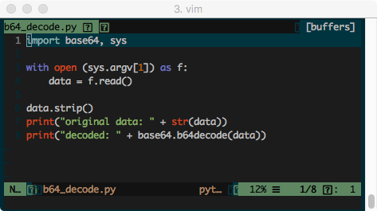
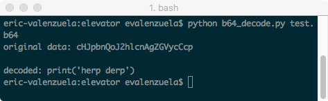
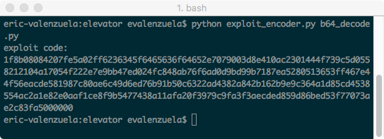
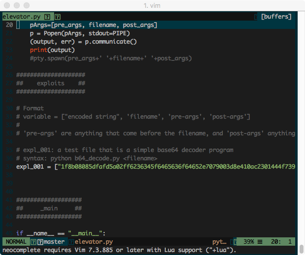
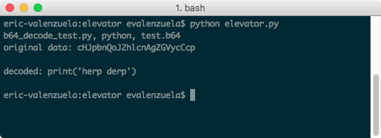

# elevator
automated linux privesc in python

Technically built for doing privesc, this is a tool at its root simply allows you to transport any file inside of another, and have that file later output those other files.
That was vague. Here's an example:

Take a simple python script to read and print out a file which contains b64-encoded data:

Here's an example of it running.

This is then passed to our handy encoder tool, from which we get a nice ascii string representing that script:

We can then take this string and place it in our delivery script, along with the arguments necessary to execute it automatically.

When we then run our script, it decodes and decompresses the script(did I mention it's compressed to save space?), then runs it using our arguments:

